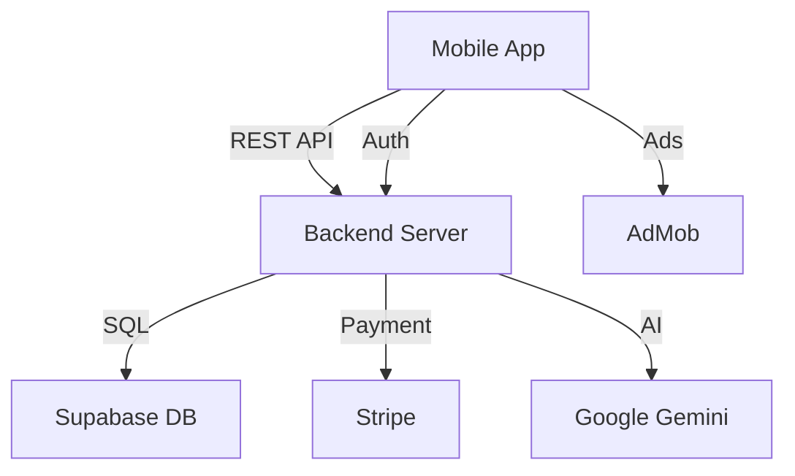

# 🎮 1000 Ravier - Q&A Competition Mobile App

> A sophisticated trivia competition platform with credits economy, real money prizes, and ad monetization.

[](PROJECT_STATUS.md)
[]()
[]()

---

## ✨ Features

### 🎯 Game Modes
- **FREE Weekly** - 1000 questions, $100 prize pool, no entry fee
- **CHALLENGE Monthly** - 100 questions, $1,000 prize, $10 entry
- **TOURNAMENT Monthly** - 1000 questions, $10,000 prize, 1000 credits entry
- **SUPER TOURNAMENT** - 1000 questions, $100,000 prize, 10,000 credits entry

### 💰 Monetization
- **Credits Economy** - Virtual currency system
- **Ad Integration** - Rewarded videos, interstitials, banners
- **In-App Purchases** - Credit bundles via Stripe
- **Entry Fees** - Paid game modes
- **Daily Rewards** - Free daily credits

### 🏆 Competition System
- **Real-time Leaderboards** - Live rankings during competitions
- **Winner Management** - Automated prize distribution
- **Anti-cheat System** - Device tracking, rate limiting
- **Tiebreakers** - Fair ranking with multiple criteria

### 📱 User Experience
- **Beautiful UI/UX** - Modern, intuitive design
- **Redux State Management** - Smooth, responsive experience
- **Offline Support** - Question batching for poor connections
- **Multi-language** - German and English support

---

## 🚀 Quick Start

### Prerequisites
- Node.js v18+
- npm v9+
- Expo CLI
- Supabase account (free)

### Installation

```bash
# Clone repository (if applicable)
cd c:/Projects/1000ravier-mobileapp

# Install all dependencies
npm install

# Setup backend
cd packages/backend
npm install
cp .env.example .env
# Edit .env with your Supabase credentials

# Setup mobile
cd ../mobile
npm install

# Go back to root
cd ../..
```

### Database Setup

1. Create Supabase project at [supabase.com](https://supabase.com)
2. Run migration: Copy `packages/backend/supabase/migrations/20231018000000_initial_schema.sql` to Supabase SQL Editor
3. Seed questions: `cd packages/backend && npm run seed:questions`

### Launch

```bash
# Terminal 1 - Backend
cd packages/backend
npm run dev

# Terminal 2 - Mobile
cd packages/mobile
npm start
```

📚 **Full guide:** See [QUICK_START.md](QUICK_START.md) or [COMPLETE_SETUP_GUIDE.md](COMPLETE_SETUP_GUIDE.md)

---

## 📦 Project Structure

```
1000ravier-mobileapp/
├── packages/
│   ├── mobile/          # React Native Expo app
│   ├── backend/         # Express.js API
│   └── shared/          # Shared types & config
├── generate_questions.js            # AI trivia generator
├── industry_specific_questions.js   # Industry-focused generator
├── QUICK_START.md                   # 5-minute quickstart
├── COMPLETE_SETUP_GUIDE.md          # Full setup guide
└── PROJECT_STATUS.md                # Current status
```

---

## 🗄️ Database Schema

**✅ Complete Supabase Schema Ready!**

- **30+ Tables** - Users, games, payments, leaderboards, achievements
- **50+ Indexes** - Optimized for performance
- **10+ Functions** - Automated calculations and rankings
- **20+ Triggers** - Auto-update statistics and data
- **Full RLS** - Row-level security on all tables
- **Sample Data** - 4 game modes, 4 bundles, 7 achievements pre-seeded

📊 **Files:**
- `packages/backend/supabase/COMPLETE_SCHEMA.sql` - Full production schema
- `packages/backend/supabase/SCHEMA_GUIDE.md` - Complete documentation
- `DATABASE_SETUP_COMPLETE.md` - Setup instructions

---

## 🛠️ Tech Stack

### Mobile App
- **Framework:** React Native + Expo 50
- **State:** Redux Toolkit + Redux Persist
- **Navigation:** React Navigation 6
- **Payments:** Stripe React Native
- **Ads:** Google AdMob (expo-ads-admob)
- **Language:** TypeScript

### Backend
- **Framework:** Express.js
- **Database:** Supabase (PostgreSQL)
- **Auth:** JWT with bcrypt
- **Payments:** Stripe
- **Security:** Helmet, CORS, Rate Limiting
- **Logging:** Winston
- **Language:** TypeScript

### AI Integration
- **Model:** Google Gemini 2.5 Pro
- **Capabilities:** Question generation, web search
- **Output:** JSON-formatted trivia questions

---

## 🎨 Current Configuration

### Test Mode (Active) ✅
- **AdMob:** Using Google's official test ad units
- **Stripe:** Test mode with mock payments
- **Environment:** Development/localhost
- **Database:** Supabase development project

### What Works Now
- ✅ User authentication
- ✅ Wallet & credits management
- ✅ Daily credit claims
- ✅ Ad watching (test ads)
- ✅ Credit purchases (mock)
- ✅ Game session play
- ✅ Leaderboards
- ✅ Transaction history

---

## 📊 System Architecture



---

## 🔐 Security Features

- JWT authentication with secure tokens
- Row Level Security (RLS) in database
- Password hashing with bcrypt
- Rate limiting (100 req/15min)
- CORS protection
- Input validation (Zod schemas)
- Anti-cheat mechanisms
- Device & IP tracking

---

## 📱 Screens

### Authentication
- Login, Register, Forgot Password

### Main Tabs
- **Home** - Dashboard with game modes
- **Wallet** - Balance, transactions, stats
- **Game** - Active sessions, question display
- **Leaderboard** - Rankings, winners, history
- **Profile** - Settings, achievements

### Additional
- Enhanced Credit Store (buy/earn credits)
- Transaction History
- Game Results
- Winner Details

---

## 🎯 Game Flow

1. **User registers** → Gets welcome credits
2. **Claims daily credits** → 10 credits/day
3. **Watches ads** → 50 credits per rewarded video
4. **Or purchases credits** → Via Stripe ($0.99 - $19.99)
5. **Joins game mode** → Spends credits or USD
6. **Plays questions** → Earns points
7. **Completes session** → Enters leaderboard
8. **Top 10 win** → Real money prizes

---

## 🧪 Testing

### Manual Testing Checklist
- [ ] User registration & login
- [ ] Daily credit claim
- [ ] Watch rewarded ad (test ad)
- [ ] Play FREE mode game
- [ ] Play TOURNAMENT mode (1000 credits)
- [ ] View leaderboard
- [ ] Check transaction history
- [ ] Mock credit purchase

### API Endpoints Testing
```bash
# Health check
curl http://localhost:3000/health

# Config (no auth required)
curl http://localhost:3000/api/config

# Login
curl -X POST http://localhost:3000/api/auth/login \
  -H "Content-Type: application/json" \
  -d '{"email":"test@example.com","password":"password"}'
```

---

## 🚀 Deployment

### Backend
- **Recommended:** Railway, Render, Heroku, AWS
- **Requirements:** Node.js, PostgreSQL access
- **Environment:** Set production .env variables

### Mobile
```bash
# Android
cd packages/mobile
expo build:android
# or: eas build --platform android

# iOS
expo build:ios
# or: eas build --platform ios
```

### Before Production
1. Replace AdMob test IDs with production
2. Add real Stripe publishable keys
3. Configure Stripe webhooks
4. Set up error tracking (Sentry)
5. Enable analytics (Firebase)
6. Add more questions (10,000+ target)

---

## 📚 Documentation

| Document | Description |
|----------|-------------|
| [QUICK_START.md](QUICK_START.md) | Get running in 5 minutes |
| [COMPLETE_SETUP_GUIDE.md](COMPLETE_SETUP_GUIDE.md) | Full setup with troubleshooting |
| [PROJECT_STATUS.md](PROJECT_STATUS.md) | Current integration status |
| [packages/mobile/INTEGRATION_GUIDE.md](packages/mobile/INTEGRATION_GUIDE.md) | Mobile integration details |
| [packages/backend/BACKEND_INTEGRATION.md](packages/backend/BACKEND_INTEGRATION.md) | Backend setup guide |

---

## 🤝 Contributing

This is a complete, production-ready codebase. To customize:

1. **Branding:** Update app name, logo, colors in `packages/mobile/`
2. **Game Config:** Edit `packages/shared/src/config.ts`
3. **Questions:** Add via seeding script or AI generators
4. **Features:** Extend existing services and screens

---

## 📝 License

MIT License - feel free to use for commercial projects

---

## 🎉 What's Included

✅ **Complete Backend API** with all endpoints  
✅ **Mobile App** with all features integrated  
✅ **Database Schema** with migrations  
✅ **AI Question Generators** (2 scripts)  
✅ **Question Seeding Script**  
✅ **Test Ad Integration** (working now)  
✅ **Payment System** (test mode ready)  
✅ **Leaderboard System** (4 screens)  
✅ **Security & Anti-cheat**  
✅ **Beautiful UI/UX**  
✅ **Comprehensive Documentation**  

---

## 📞 Support

- **Issues:** Check [COMPLETE_SETUP_GUIDE.md](COMPLETE_SETUP_GUIDE.md) troubleshooting section
- **Status:** See [PROJECT_STATUS.md](PROJECT_STATUS.md) for current integration state
- **Quick Help:** Follow [QUICK_START.md](QUICK_START.md) for common issues

---

## 🌟 Status

**Current:** ✅ **INTEGRATION COMPLETE - READY FOR TESTING**

All features integrated with test ads enabled. Ready to:
- Test all features end-to-end
- Watch test ads and earn credits
- Play games with credit-based entry
- View leaderboards and rankings
- Customize and prepare for production

**Next:** Replace test IDs when ready for production deployment.

---

**Built with ❤️ for competitive trivia gaming**

*Last Updated: 2024*
